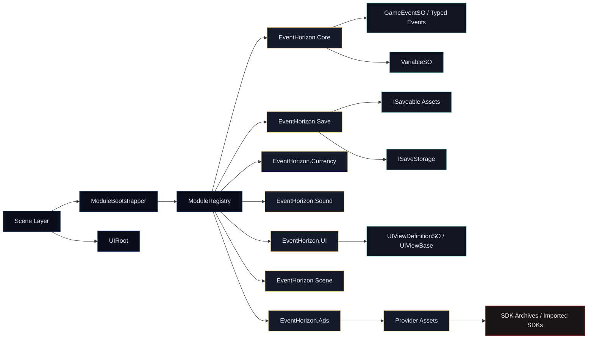

# EventHorizon Technical Overview

```text
   .   *      .      /\       .
      .    *        /==\   .
   .       .       |::::|     *
      ORBITAL OBSERVATION DECK
```

> Internal framework index for the `_EventHorizon` package tree.

## Document Scope

This document describes the structure, boundaries, and architectural intent of the `Assets/_EventHorizon` framework package inside the Arrow Out project. It should be read as the local technical index for the package-level READMEs.

## Package Profile

| Field | Value |
|---|---|
| Package Root | `Assets/_EventHorizon` |
| Unity Version | `6000.4.1f1` |
| Packaging Model | multiple Unity asmdefs + support folders |
| Runtime Foundation | `EventHorizon.Core` |
| Bootstrap Entry Point | `ModuleBootstrapper` |
| Primary Design Pattern | asset-driven modules + event channels + variable assets |

## Package Layout

| Path | Role | Notes |
|---|---|---|
| `Assets/_EventHorizon/Core` | Runtime foundation | lifecycle, events, variables, logging, runtime sets |
| `Assets/_EventHorizon/Ads` | Runtime feature module | provider-agnostic ad orchestration |
| `Assets/_EventHorizon/Currency` | Runtime feature module | wallet-based economy management |
| `Assets/_EventHorizon/Save` | Runtime feature module | persistence and storage backends |
| `Assets/_EventHorizon/Scene` | Runtime feature module | additive scene loading by registry key |
| `Assets/_EventHorizon/Sound` | Runtime feature module | cue-driven playback and pooling |
| `Assets/_EventHorizon/UI` | Runtime feature module | navigation stack and runtime views |
| `Assets/_EventHorizon/Core/Editor` | Editor support | inspector tooling for core abstractions |
| `Assets/_EventHorizon/Editor` | Editor tooling | setup, save inspection, logs, workspace UI |
| `Assets/_EventHorizon/SDKs` | Support folder | packaged vendor SDK archives |
| `Assets/_EventHorizon/_Example` | Reference layer | usage examples and integration sketches |

## Architectural Model

### Runtime layer split

The framework is intentionally divided into four concerns:

| Layer | Responsibility |
|---|---|
| Scene relays | bridge Unity scene objects into the module layer |
| Runtime modules | own feature logic and long-lived system behavior |
| Data assets | carry state and messages between systems |
| Editor tooling | support inspection, setup, and debugging |

### Key architectural rules

1. Scene objects should not become service locators.
2. Modules should own domain behavior.
3. Shared state should be surfaced through variable assets.
4. Cross-system intent should be communicated through events.
5. Lifecycle ordering should be explicit through `ModuleRegistry`.

## Framework Topology



## Assembly Boundaries

| Assembly | Type | Depends On |
|---|---|---|
| `EventHorizon.Core` | Runtime | none |
| `EventHorizon.Core.Editor` | Editor-only | `EventHorizon.Core` |
| `EventHorizon.Ads` | Runtime | `EventHorizon.Core` |
| `EventHorizon.Currency` | Runtime | `EventHorizon.Core` |
| `EventHorizon.Save` | Runtime | `EventHorizon.Core` |
| `EventHorizon.Sound` | Runtime | `EventHorizon.Core` |
| `EventHorizon.UI` | Runtime | `EventHorizon.Core` |
| `EventHorizon.Editor` | Editor-only | `EventHorizon.Core`, `EventHorizon.UI`, `EventHorizon.Core.Editor` |
| `EventHorizon.Example` | Runtime reference | `EventHorizon.Core`, `EventHorizon.UI`, `EventHorizon.Currency`, `EventHorizon.Sound`, `Unity.TextMeshPro` |

## Runtime Flow Summary

| Phase | Description |
|---|---|
| Bootstrap | `ModuleBootstrapper` invokes the registry from the scene |
| Initialize | each module runs `Initialize()` in registry order |
| Activate | each initialized module immediately enters active state |
| Operate | systems communicate through variables, event channels, and module-owned APIs |
| Deactivate | registry tears modules down in reverse order |
| Dispose | module resources and subscriptions are released |

## Recommended Reading Order

1. [Core](./Core/README.md)
2. [UI](./UI/README.md)
3. [Save](./Save/README.md)
4. [Currency](./Currency/README.md)
5. [Sound](./Sound/README.md)
6. [Scene](./Scene/README.md)
7. [Ads](./Ads/README.md)
8. [Editor](./Editor/README.md)
9. [SDKs](./SDKs/README.md)
10. [_Example](./_Example/README.md)

## Module Index

| Module | Main Runtime Asset | Main Purpose |
|---|---|---|
| Core | `ModuleRegistry`, `GameEventSO`, `VariableSO<T>` | foundational infrastructure |
| Ads | `AdsManagerModuleSO` | ad request routing and provider fallback |
| Currency | `CurrencyModuleSO` | wallet mutation and transaction signaling |
| Save | `SaveModuleSO` | persistence orchestration |
| Scene | `BaseControllerModuleSO` | additive scene loading and unloading |
| Sound | `SoundModuleSO` | centralized audio playback |
| UI | `UIModuleSO` | view management and navigation |
| Editor | `LaunchSequence`, `ObservationDeck`, `DataOrbit` | tooling and diagnostics |
| SDKs | packaged `.unitypackage` files | optional third-party dependencies |
| Example | sample consumers | reference usage patterns |

## Documentation Map

- [Core README](./Core/README.md)
- [Ads README](./Ads/README.md)
- [Currency README](./Currency/README.md)
- [Editor README](./Editor/README.md)
- [Save README](./Save/README.md)
- [Scene README](./Scene/README.md)
- [SDKs README](./SDKs/README.md)
- [Sound README](./Sound/README.md)
- [UI README](./UI/README.md)
- [_Example README](./_Example/README.md)

<table width="100%">
  <tr>
    <td bgcolor="#57A8A8" width="25%"></td>
    <td bgcolor="#30B06E" width="25%"></td>
    <td bgcolor="#D1AD29" width="25%"></td>
    <td bgcolor="#C7262E" width="25%"></td>
  </tr>
</table>

```text
          _|_
---@----(_)--@---
          | |
          ./ \.

    .-----.   .-----.   .-----.
    | Fe  |   | Li  |   | Na  |
    '-----'   '-----'   '-----'
     BLOOD      METH     TEARS
```

